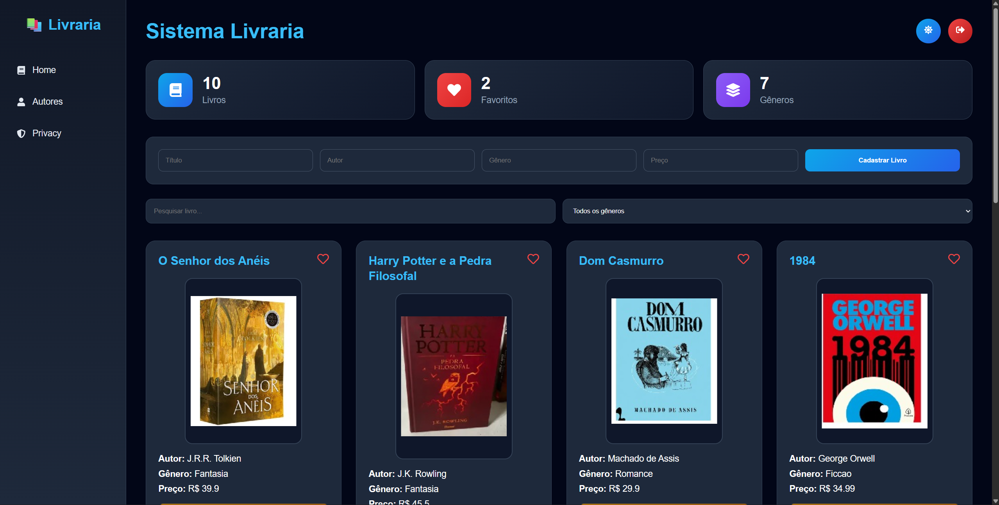
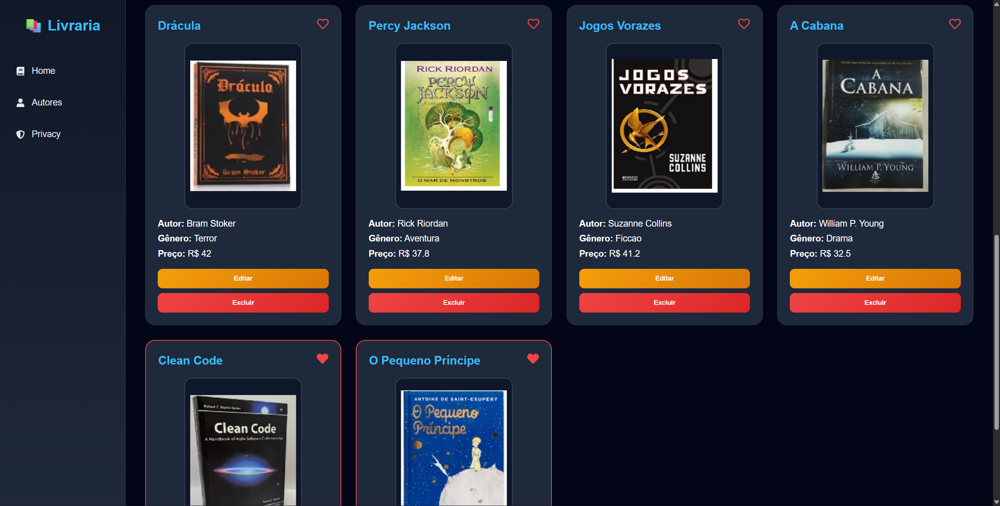
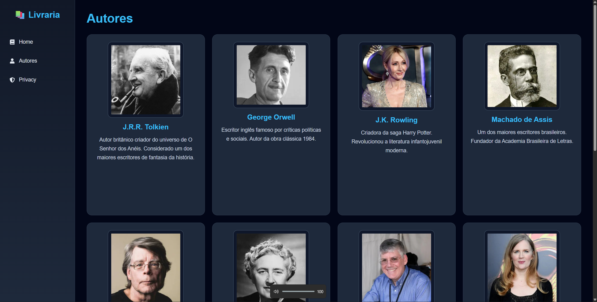
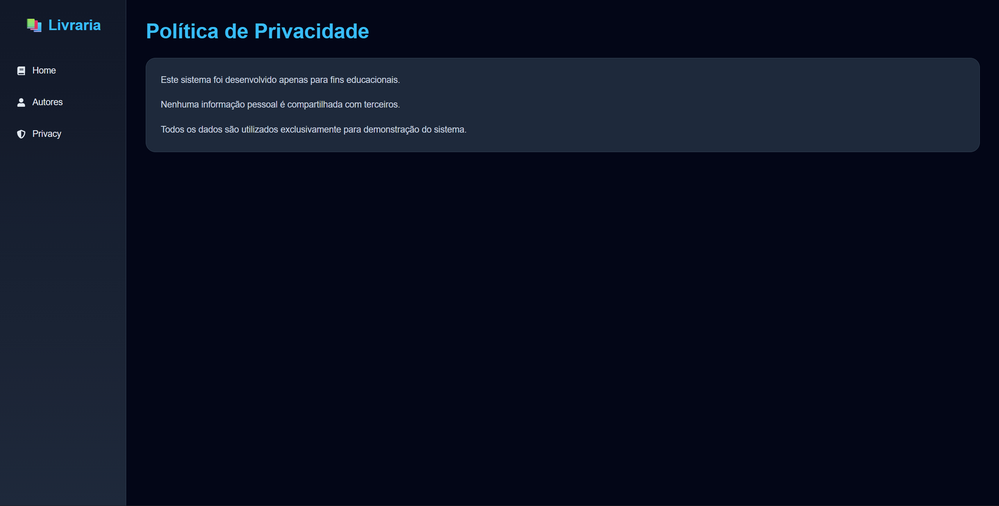
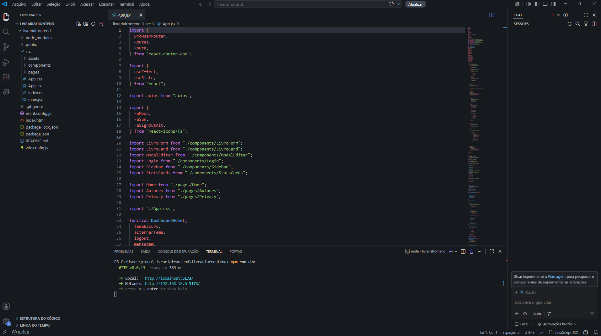

# React + Vite

This template provides a minimal setup to get React working in Vite with HMR and some ESLint rules.

Currently, two official plugins are available:

- [@vitejs/plugin-react](https://github.com/vitejs/vite-plugin-react/blob/main/packages/plugin-react) uses [Oxc](https://oxc.rs)
- [@vitejs/plugin-react-swc](https://github.com/vitejs/vite-plugin-react/blob/main/packages/plugin-react-swc) uses [SWC](https://swc.rs/)

## React Compiler

The React Compiler is not enabled on this template because of its impact on dev & build performances. To add it, see [this documentation](https://react.dev/learn/react-compiler/installation).

## Expanding the ESLint configuration

If you are developing a production application, we recommend using TypeScript with type-aware lint rules enabled. Check out the [TS template](https://github.com/vitejs/vite/tree/main/packages/create-vite/template-react-ts) for information on how to integrate TypeScript and [`typescript-eslint`](https://typescript-eslint.io) in your project.
# 📚 Sistema de Livraria Frontend

Projeto frontend de um sistema de livraria desenvolvido com **React + Vite**, criado com foco em aprendizado prático de desenvolvimento web moderno.

O projeto possui funcionalidades relacionadas à exibição de livros, autores, login e organização de componentes reutilizáveis, servindo como prática para conceitos de:

* React
* Componentização
* React Router 
* Consumo de API com Axios
* Organização de pastas
* Estilização com CSS
* Estruturação de aplicações frontend

---

# 🚀 Tecnologias Utilizadas

## Frontend

* React 19
* Vite
* React Router DOM
* Axios
* React Icons
* CSS3
* JavaScript (ES6+)

---

# 📁 Estrutura do Projeto

```bash
src/
 ├── assets/
 │    ├── autores/
 │    └── livros/
 │
 ├── components/
 │    ├── LivroCard.jsx
 │    ├── LivroForm.jsx
 │    ├── Login.jsx
 │    ├── ModalEditar.jsx
 │    ├── Sidebar.jsx
 │    └── StatsCards.jsx
 │
 ├── pages/
 │    ├── Autores.jsx
 │    ├── Home.jsx
 │    └── Privacy.jsx
 │
 ├── App.jsx
 ├── App.css
 ├── index.css
 └── main.jsx
```

---

# ✨ Funcionalidades

* 📖 Exibição de livros
* ✍️ Exibição de autores
* 🔐 Tela de login
* 📝 Formulários para cadastro/edição
* 📊 Cards de estatísticas
* 📦 Componentes reutilizáveis
* 🧭 Navegação entre páginas
* 🎨 Interface estilizada

---

# 🛠️ Como Executar o Projeto

## 1️⃣ Clone o repositório

```bash
git clone URL_DO_SEU_REPOSITORIO
```

---

## 2️⃣ Acesse a pasta do projeto

```bash
cd livrariafrontend
```

---

## 3️⃣ Instale as dependências

```bash
npm install
```

---

## 4️⃣ Execute o projeto

```bash
npm run dev
```

---

## 5️⃣ Abra no navegador

```bash
http://localhost:5173
```

---

# 📦 Scripts Disponíveis

## Executar ambiente de desenvolvimento

```bash
npm run dev
```

## Gerar build de produção

```bash
npm run build
```

## Visualizar build

```bash
npm run preview
```

## Executar ESLint

```bash
npm run lint
```

---

# 🎯 Objetivo do Projeto

Este projeto foi desenvolvido com objetivo educacional para praticar:

* Desenvolvimento frontend com React
* Organização de componentes
* Estruturação de aplicações escaláveis
* Integração futura com backend Java
* Conceitos de CRUD
* Navegação entre páginas
* Manipulação de estado

---

# 📚 Aprendizados

Durante o desenvolvimento deste projeto foram praticados conceitos importantes como:

* Componentização
* Props
* Organização de código
* Renderização dinâmica
* Estrutura SPA
* Consumo de APIs
* Rotas com React Router
* Boas práticas de frontend

---

# 🔮 Melhorias Futuras

* Integração completa com backend Java
* Sistema de autenticação JWT
* Banco de dados integrado
* Cadastro real de livros e autores
* Responsividade avançada
* Dashboard administrativo
* Deploy em nuvem

---

# 👨‍💻 Autor

Projeto desenvolvido para fins de estudo e prática em programação.

---

# 📄 Licença

Este projeto é apenas para fins educacionais.


# Pagina Inicial (Home)





# Pagina Autores (Authors)



# Pagina Privacidade (Privacy)



# VS Code (LivrariaFrontend)


